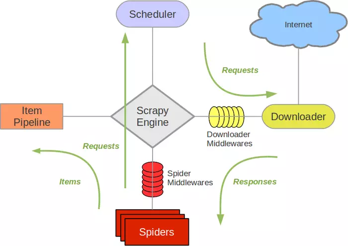
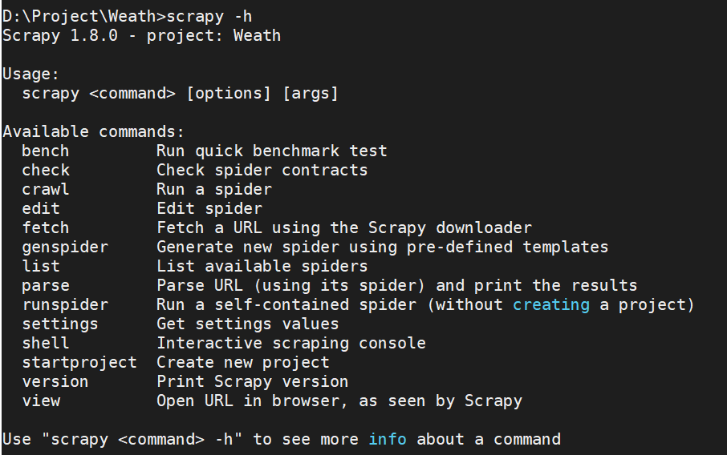
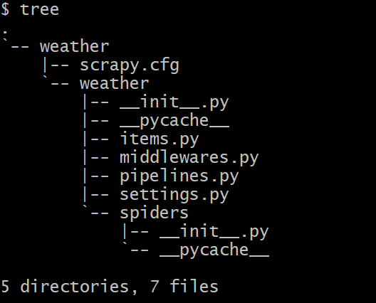
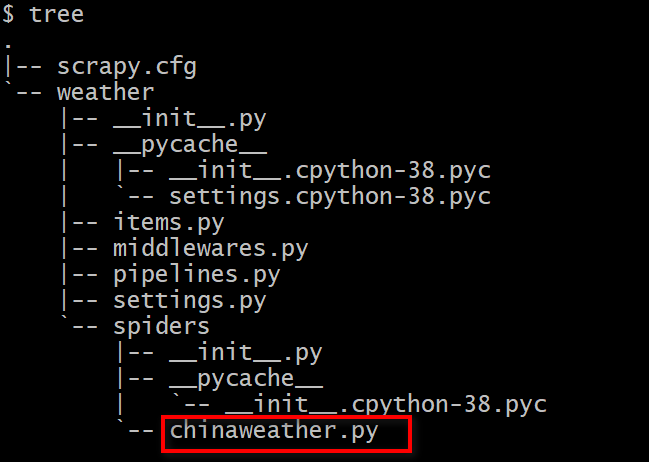

# public-booking-framework

public-booking-framework主要通过scrapy实现。

## scrapy 简介
Scrapy是用纯Python实现一个为了爬取网站数据、提取结构性数据而编写的应用框架，用途非常广泛。框架功能非常强大，用户只需要定制开发几个模块就可以轻松的实现一个爬虫，用来抓取网页内容以及各种图片，非常之方便。Scrapy 使用了 Twisted异步网络框架来处理网络通讯，可以加快我们的下载速度，不用自己去实现异步框架，并且包含了各种中间件接口，可以灵活的完成各种需求。  
## scrapy 框架流程
Scrapy框架流程如下图所示，有如下几个模块：  
	- Scrapy Engine（Scrapy引擎）：Scrapy Engine是用来控制整个爬虫系统的数据处理流程，是整个爬虫软件核心中枢，协调各个模块运行，并进行不同事务触发。
	- Sheduler（调度器）：Scheduler维护着待爬取的URL队列，调度器从Scrapy Engine接收URL请求时，会对请求做去重处理，并会从待爬取的URL队列中取出下一个URL返还给Scrapy Engine。
	- Downloader（下载器）：Downloader从Scrapy Engine那里得到需要下载的URL，向网站发送网络请求进行页面网页，最后再将网页内容传递到Scrapy Engine。如果需要定制更复杂的网络请求（通常用于反爬），可以通过Downloader中间件来实现。
	- Spiders（蜘蛛）：Spiders是用户主要实现代码逻辑部分。用户通过编写spider.py这个类实现指定要爬取的网站地址、定义网址过滤规则、解析目标数据等。 Spider发出请求，并处理Scrapy Engine返回给它下载器响应数据，把解析到的数据以item的形式传递给Item Pipeline，把解析到的链接传递给Scheduler。
	- Item Pipeline：主要负责处理从网页中抽取的item进行清洗、验证，并且将数据持久化，如将数据存入数据库或者文件。
	- Downloader middlewares：Downloader middlewares是位于Scrapy Engine和Downloader之间的钩子框架，主要是处理Scrapy Engine与Downloader之间的请求及响应。可以代替接收请求、处理数据的下载以及将结果响应给Scrapy Engine。
	- Spider middlewares：介于Scrapy Engine和Spiders之间的钩子框架，主要是处理Spiders的响应输入和请求输出。可以插入自定义的代码来处理发送给Spiders的请求和返回Spider获取的响应内容和项目。



  
图中绿色线条表示数据流向，首先从初始 URL 开始，Scheduler 会将其交给 Downloader，Downloader向网络服务器发送服务请求进行下载，得到响应后将下载的数据交给Spider，Spider会对网页进行分析，分析出来的结果有两种：一种是需要进一步抓取的链接，这些链接会被传回 Scheduler；另一种是需要保存的数据，它们则被送到 Pipeline，Item会定义数据格式，最后由Pipeline对数据进行清洗、去重等处理后存储到文件或数据库。
Scrapy执行步骤大致如下:
	1. Engine从Spiders那获取第一个需要爬取的URL，然后作为请求发送给Sheduler。
	2. Engine从Sheduler那获取下一个将要爬取的页面。
	3. Engine将需要爬取的页面通过下载中间件发送到Downloader。
	4. 当网页被下载器下载完成以后，响应内容通过下载中间件被发送到Engine。
	5. Engine收到Downloader的响应并将它通过蜘蛛中间件发送到Spiders进行处理。
	6. Spiders处理响应并返回爬取到的item以及页面中其它符合规则的URL链接，并把它们发送给Engine。
	7. Engine发送处理后的item到Item Pipeline；Engine把URL发送给Sheduler，然后从Sheduler获取下一个页面进行爬取抓取。
	8. 系统重复2-7的操作，直到Sheduler没有请求。
## scrapy 安装与使用
通过pip安装即可
> pip3 install Scrapy
  

&ensp;&ensp;&ensp;&ensp;scrapy总体上看与Django比较相似目录组织方式，另外也提供命令行。在scrapy安装完毕完毕后，通过如下命令查看支持的命令。
> scrapy
或者
> scrapy -h  
  


### 新建项目

例如新建weather项目：
```
scrapy startproject weather
New Scrapy project 'weather', using template directory 'c:\users\86158\appdata\local\programs\python\python38-32\lib\site-packages\scrapy\templates\project', created in:
    D:\test\weather

You can start your first spider with:
    cd weather
    scrapy genspider example example.com
```


创建项目后，会在当前文件夹下创建一个与项目名同名文件夹，目录内容如下图所示。  

 

- item.py定义spider抓取内容信息；
- pipelines.py即框架说明中Item Pipeline部分；
- middlewares.py为自定义各种中间件；
- settings.py为配置信息；
- spiders为爬虫逻辑所在目录。


### 创建spider

一个项目可以存在多个spider，通过如下命令创建一个spider
`scrapy genspider [-d  templatename]  spidername 域名`
 
templatename支持basic，crawl，csvfeed，xmlfeed，默认为basic。其中：basic生成的代码继承自spider，偏底层，比较灵活，缺点是主要逻辑由自己实现；crawl生成的代码继承自crawlspider，是对spider封装，适合全站抓取，优点是自己只需关注提取数据逻辑以及页面链接提取规则；csvfeed与xmlfeed没有研究过，可能是适用于CSV与XML文件的爬取。
通过`scrapy  genspider  -l`查看支持模板，如
```
D:\>scrapy  genspider  -l 
Available templates:
  basic  
  crawl
  csvfeed
  xmlfeed
```

如创建一个spider，名为chinaweather，并且采用crawl模板，会在spider文件夹下生成chinaweather.py文件，如下图所示。
`scrapy genspider -d crawl chinaweather chinaweather.com.cn`



生成的代码如下图所示


<font color=#ff0000 size=4>注意：从scrapy源码中可以看出，若使用basic模板，则必须实现parse方法，由parse实现主要爬虫逻辑；但若使用crawl模板，千万不要覆盖parse方法。</font>

## 主要代码 
item.py定义了在spider中抓取的数据并发往Item pipeline信息。代码如下：
```python
import scrapy

class WeathItem(scrapy.Item):
    city = scrapy.Field()  # 城市信息：“江苏|苏州|太仓” 或者景点信息 “江苏|常熟|沙家浜风景区”

    year  = scrapy.Field()   # 年
    month = scrapy.Field()   # 月
    day   = scrapy.Field()   # 日

    dt_winddirect = scrapy.Field()  # 白天风向
    dt_windlevel  = scrapy.Field()  # 白天风力
    max_temper    = scrapy.Field()  # 白天最高温度
    sunrise_time  = scrapy.Field()  # 日出时间

    nt_winddirect = scrapy.Field()  # 夜间风向
    nt_windlevel  = scrapy.Field()  # 夜间风力
    min_temper    = scrapy.Field()  # 夜晚最低温度
    sunset_time   = scrapy.Field()  # 日落时间
```

chinaweather.py实现了主要爬虫逻辑，其代码如下：
```python
import scrapy
from scrapy.linkextractors import LinkExtractor
from scrapy.spiders import CrawlSpider, Rule
from Weath.items import WeathItem
import datetime

#每个页面数据提取
def parse_item(response):
    item = WeathItem()

    main_city = "|".join(response.xpath("//div[@class='crumbs fl']//a/text()").extract())
    if main_city == "":
        return None
    suffix_info = response.xpath("//div[@class='crumbs fl']/span[last()]/text()").extract()
    if len(suffix_info):
        main_city += "|"
        main_city += suffix_info[0]
    item["city"] = main_city.replace("全国|", "")

    item["year"] = datetime.datetime.now().year
    item["month"] = datetime.datetime.now().month
    item["day"] = datetime.datetime.now().day

    item["max_temper"] = response.xpath(
        "//div[@class='today clearfix']//ul[@class='clearfix']/li[1]//p[@class='tem']/span/text()").extract()[0]
    item["dt_windlevel"] = response.xpath(
        "//div[@class='today clearfix']//ul[@class='clearfix']/li[1]//p[@class='win']/span/text()").extract()[0]
    item["dt_winddirect"] = response.xpath(
        "//div[@class='today clearfix']//ul[@class='clearfix']/li[1]//p[@class='win']/span/@title").extract()[0]
    item["sunrise_time"] = response.xpath("//div[@class='today clearfix']//ul[@class='clearfix']/li[1]//p[@class='sun sunUp']/span/text()").extract()[0].split()[1]

    item["min_temper"] = response.xpath(
        "//div[@class='today clearfix']//ul[@class='clearfix']/li[2]//p[@class='tem']/span/text()").extract()[0]
    item["nt_windlevel"] = response.xpath(
        "//div[@class='today clearfix']//ul[@class='clearfix']/li[2]//p[@class='win']/span/text()").extract()[0]
    item["nt_winddirect"] = response.xpath(
        "//div[@class='today clearfix']//ul[@class='clearfix']/li[2]//p[@class='win']/span/@title").extract()[0]
    item["sunset_time"] = response.xpath(
        "//div[@class='today clearfix']//ul[@class='clearfix']/li[2]//p[@class='sun sunDown']/span/text()").extract()[0].split()[1]
    return item

class ChinaweatherSpider(CrawlSpider):
    name = 'chinaweather'
    allowed_domains = ['weather.com.cn']
    start_urls = ['http://www.weather.com.cn']
	#URL链接提取规则，使用正则；callback为页面数据提取回调接口；follow是否递归#提取页面URL链接
    rules = (
        Rule(LinkExtractor(allow=r'http://www.weather.com.cn/weather1d/\d{9}.shtml'), callback= parse_item, follow=True),
    )
```

pipelines.py进行清洗、验证，并且将数据持久化，如将数据存入数据库或者文件。
<font color=#ff0000 size=4>
注意：
每个pipeline根据需求分别实现如下方法：
1. from_crawler(cls, crawler)类方法常用于从settings获取配置；
2. open_spider(self, spider)爬虫开始运行调用方法，常用于资源的申请；
3. close_spider(self, spider)爬虫结束时调用方法，常用于资源的释放；
4. process_item(self, item, spider)实现数据清洗，验证，持久化等操作，item为spider抓取到的数据，若函数抛出DropItem，则终止流水线后续操作，若返回item，交由流水线低优先级处理。
</font>


```
from scrapy.exceptions import DropItem
import nsq
import json
import urllib
import pymysql

#自定义爬取数据去重
class WeathPipelineUnique(object):
    def __init__(self):
        self.has_seen = set()

    def process_item(self, item, spider):
        city = item["city"]
        if city in self.has_seen:
            raise DropItem("Duplicate book found:%s" % item)
        self.has_seen.add(city)
        return item

#自定义爬取数据写入MYSQL数据库
class MySqlPipeline(object):
    def __init__(self, host, port, user, passwd, database):
        self.host = host
        self.port = port
        self.user = user
        self.passwd = passwd
        self.database = database
        self.con = None
        self.cur = None

    @classmethod
    def from_crawler(cls, crawler):
        return cls(
            host = crawler.settings.get('MYSQL_HOST', "127.0.0.1"),
            port = crawler.settings.get('MYSQL_PORT', 3306),
            user = crawler.settings.get('MYSQL_USER', "test"),
            passwd = crawler.settings.get('MYSQL_PASSWD', "123456"),
            database = crawler.settings.get('MYSQL_DATABASE', "weather"),
        )

    def open_spider(self, spider):
        self.con = pymysql.connect(host=self.host, port=self.port, user=self.user, password=self.passwd,
                                   db=self.database, charset='utf8')
        self.cur = self.con.cursor()

    def process_item(self, item, spider):
        data = dict(item)
        if self.cur:
            sql = """Insert into china_weather(city, year, month, day, dt_winddirect, dt_windlevel, max_temper, sunrise_time, nt_winddirect, nt_windlevel  ,min_temper, sunset_time )
            values('%s', '%s','%s', '%s','%s', '%s','%s', '%s','%s', '%s','%s', '%s')""" %(data["city"], data["year"], data["month"], data["day"], data["dt_winddirect"], data["dt_windlevel"], data["max_temper"], data["sunrise_time"], data["nt_winddirect"], data["nt_windlevel"], data["min_temper"], data["sunset_time"] )
            self.cur.execute(sql)
            self.con.commit()
        return item


    def close_spider(self, spider):
        if self.cur:
            self.cur.close()
        if self.con:
            self.con.close()

#自定义爬取数据写入JSON文件
class JsonFilePipeline(object):
    def __init__(self, json_file_name):
        self.json_file_name = json_file_name
        self.json_file      = None

    @classmethod
    def from_crawler(cls, crawler):
        return cls(
            json_file_name =crawler.settings.get('JSON_FILE_NAME', None),
        )

    def open_spider(self, spider):
        if self.json_file_name and self.json_file_name != "":
            self.json_file = open(self.json_file_name, "a")

    def process_item(self, item, spider):
        if self.json_file:
            # self.json_file.write(json.dumps(dict(item), ensure_ascii=False))
            json.dump(dict(item), fp=self.json_file, ensure_ascii=False)
        return item

    def close_spider(self, spider):
        if self.json_file:
            self.json_file.close()

#向NSQ发送消息
class NsqHttpPipeline(object):
    def __init__(self, http_url):
        self.http_url = http_url
        self.headers = {'Content-Type': 'application/json'}

    @classmethod
    def from_crawler(cls, crawler):
        return cls(
            http_url=crawler.settings.get('HTTP_URI', None),
        )

    def open_spider(self, spider):
        pass

    def process_item(self, item, spider):
        if self.http_url:
            request = urllib.request.Request(url=self.http_url, headers=self.headers,
                                             data=json.dumps(dict(item), ensure_ascii=False).encode(encoding='UTF8'))
            response = urllib.request.urlopen(request)  # 发送请求

            status_code  = response.read().decode()
        return item

    def close_spider(self, spider):
        pass

#NsqPipeline未使用，使用pynsq向nsq发送失败了，改为自己封装HTTP请求即NsqHttpPipeline向NSQ发送消息
class NsqPipeline(object):
    def __init__(self, nsq_url):
        self.nsq_url = nsq_url

    @classmethod
    def from_crawler(cls, crawler):
        return cls(
            nsq_url=crawler.settings.get('NSQ_URI'),
        )

    def open_spider(self, spider):
        self.writer = nsq.Writer([self.nsq_url])
        nsq.run()

    def process_item(self, item, spider):
        jstr = json.dumps(dict(item), ensure_ascii=False)
        self.writer.pub("weather_info", jstr, self.finish_pub_cb)
        return item

    def close_spider(self, spider):
        pass

    def finish_pub_cb(self, conn, data):
        pass
```

若要pipeline生效，还需在settings.py配置文件添加pipeline信息，其内容如下。ITEM_PIPELINES字典类型，key为pipeline实现路径字符串，value为0-1000之间整数值，值大小表示优先级，数值越小表示在流水线中优先级越高，即越早处理。

```
BOT_NAME = 'Weath'

SPIDER_MODULES = ['Weath.spiders']
NEWSPIDER_MODULE = 'Weath.spiders'

################################################################################################################
如下为自定义配置部分
################################################################################################################

USER_AGENT = 'Mozilla/5.0 (Windows NT 10.0; Win64; x64) AppleWebKit/537.36 (KHTML, like Gecko) Chrome/74.0.3729.131 Safari/537.36'

#采用pynsq发送到nsq,失败了
NSQ_URI = "127.0.0.1:4151"

#以自定义HTTP请求发送到NSQ的URL
HTTP_URI = "http://127.0.0.1:4151/pub?topic=china_weather"

#JSON文件名配置
JSON_FILE_NAME = "chaina-weather.json"

#MySQL配置
MYSQL_HOST = "127.0.0.1"
MYSQL_PORT = 3306
MYSQL_USER = "test"
MYSQL_PASSWD   = "123456"
MYSQL_DATABASE = "weather"

#pipelines配置
ITEM_PIPELINES = {
    'Weath.pipelines.WeathPipelineUnique': 300,     #数据去重
    'Weath.pipelines.NsqHttpPipeline'    : 400,     #数据写入NSQ
    'Weath.pipelines.JsonFilePipeline'   : 500,     #数据写入JSON文件
    'Weath.pipelines.MySqlPipeline'      : 600,     #数据写入MySql
}
```

## 启动spider
有两种运行spider方式：


- 通过命令行的方式
> scrapy crawl spidername，如
> scrapy crawl chinaweather

- 通过python文件启动
  ```
  from scrapy import cmdline

  cmdline.execute("scrapy crawl chinaweather".split())
  ```
